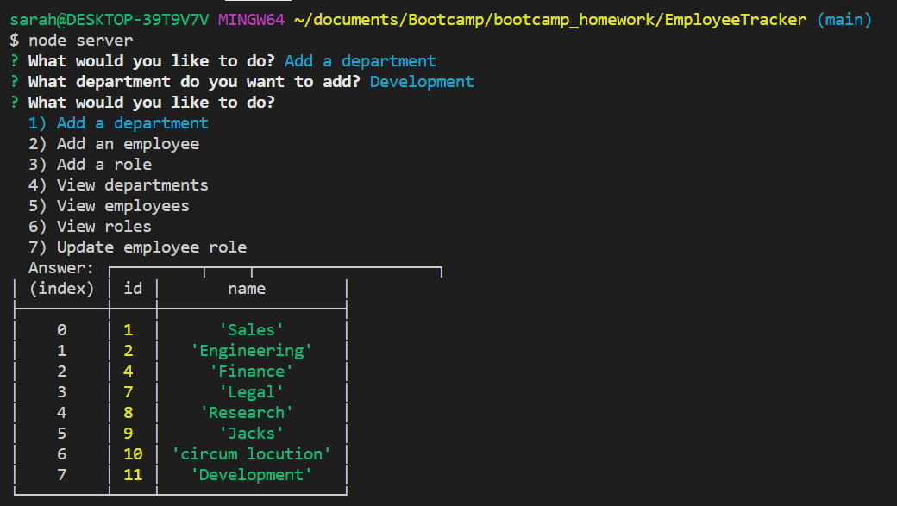
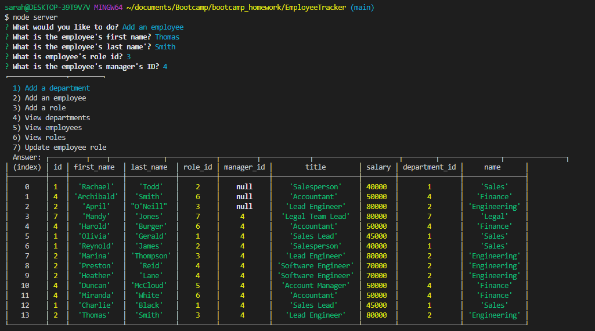
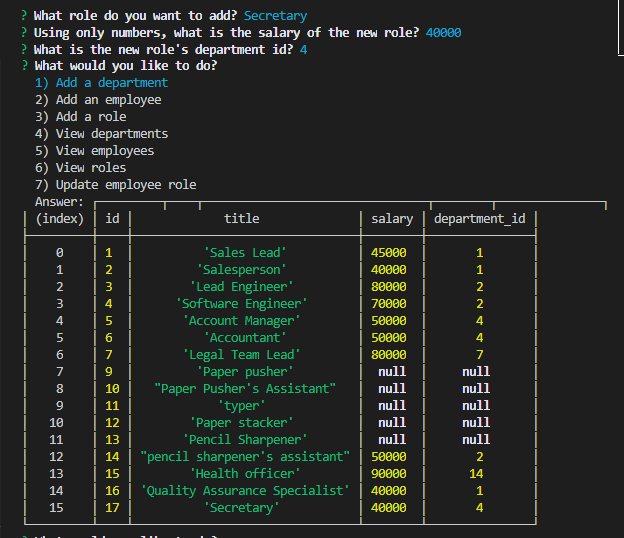
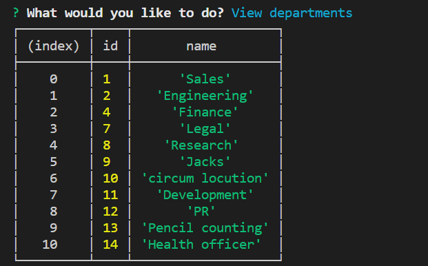
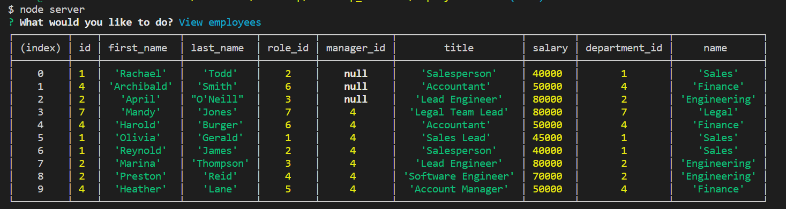
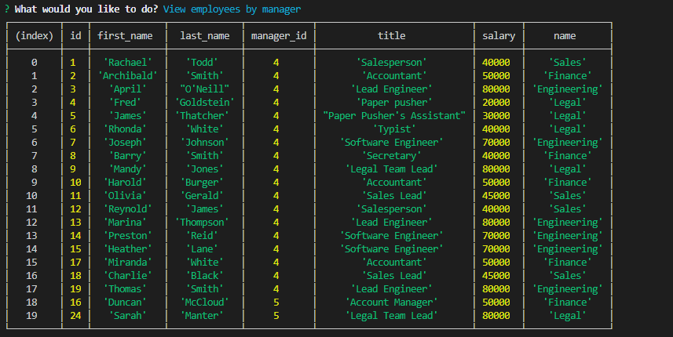
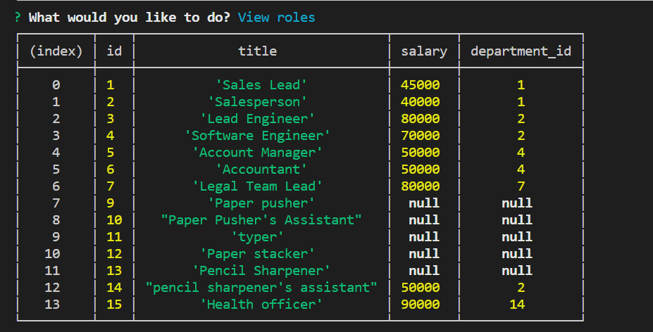
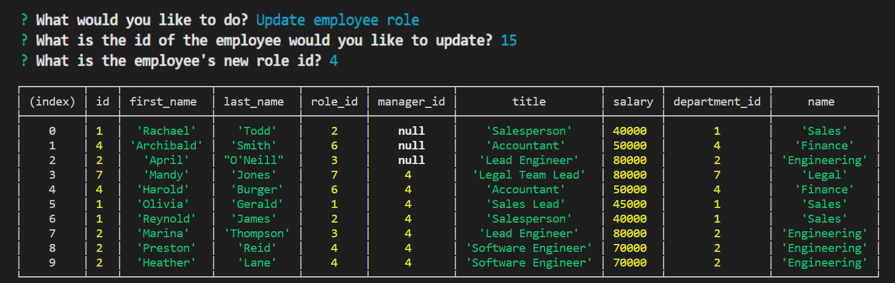

# EmployeeTracker

## Description

A Content Management System for managing a company's employees using node, inquirer, and MySQL. Users are able to view or add departments, employees, and employee roles within the database. They are also able to view employees by manager, update employee roles, update an employee's manager, and delete employees, roles, or departments. Lastly, they can view the salary budgets by department.

## Screenshots

Add Department:

Add Employee:

Add Role:

View Department:

View Employee:

View Employees by Manager:

View Role:

View Department Budgets:

Update Employee's Role:

## Table of Contents

- [Technologies](#Technologies)
- [Usage](#Usage)
- [Installation](#Installation)
- [Feedback](#Feedback)
- [Challenges](#Challenges)
- [Walkthrough](#Walkthrough)

## Technologies

- node.js
- Inquirer
- MySql
- console.table

## Usage

Business owners who want to be able to manage the departments within their buisiness by tracking employee information, including employees' roles within the company will be able to do so with this app.

## Installation

- Install [node.js](https://nodejs.org/en/download/)
- In node.js Integrated Terminal, run `npm install inquirer`
- In node.js Integrated Terminal, run `npm install mysql`
- In node.js Integrated Terminal, run `npm install console.table`

## Feedback

Contact me with any feedback or questions through GitHub or by email.

- [GitHub](https://github.com/smanter82)

- Email: sarahmanter@gmail.com

## Challenges

- Getting inquirer to play nice with connection queries
- Inserting / Updating with connection queries using question marks

## Walkthrough

Walkthrough video link:
[Walkthrough_Video](https://drive.google.com/file/d/16wwgFVk9jyKBXV1mMqtB14lKW2YhFheA/view)

Some code on this application may have been done in collaboration with my Bootcamp study group classmates: https://github.com/arensalmela, https://github.com/dmaysteinman, https://github.com/EddiePhi, https://github.com/ReindeerCode, https://github.com/DustinErwin, https://github.com/Ewager1, https://github.com/mdjonestwo, https://github.com/shannonquinn91/Note-Taker, https://github.com/JesalDM
